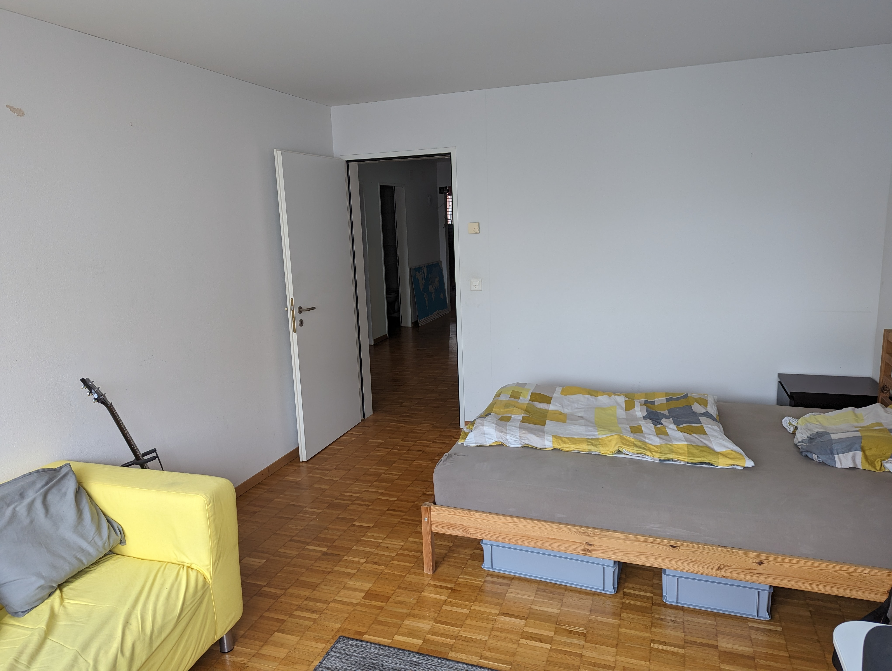
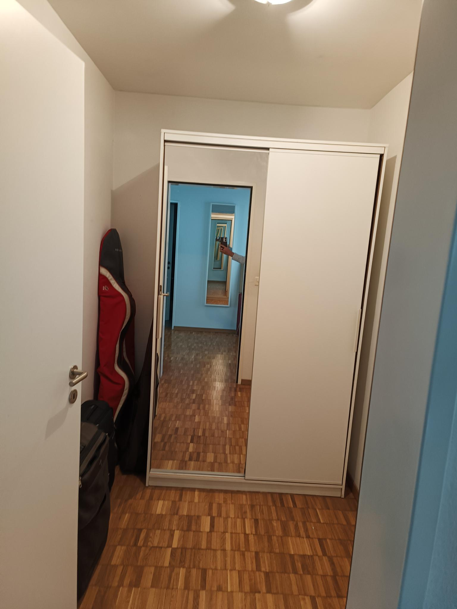

## [Heinrichstrasse 255 — next to Escher-Wyss-Platz and Schiffbau](https://goo.gl/maps/5M6nC61x44gEojCz6)

**When**: May 1st 2023

!**Where**: [Heinrichstrasse 255 – Google Maps](https://goo.gl/maps/5M6nC61x44gEojCz6) 

**Rent**: CHF 1200.-/ Month

### The vacant room

[Pictures](#your-room)

**Area**: 16 m² room  
**Walk-in closet**: 4 m² 

Bathroom shared with one roommate

The shared flat room is unfurnished – individual pieces of furniture can be taken over from the previous tenant upon request (arrangement with the previous tenant).

### The entire flat

[Pictures](#the-flat)

- **Area**: 177 m²
- 5½ rooms
- Duplex (2 floors) | 4th and 5th floor | Entrance on the 5th floor
- Very central location (Escher-Wyss-Platz, Hardbrücke), yet relatively quiet
- Entire flat except kitchen and bathrooms has parquet floors with underfloor heating
- Own washing machine and dryer
- Spacious living room with kitchen and dishwasher
- 2 bathrooms plus an extra toilet in the own laundry room
- Guest room with bed etc.
- Access to a huge roof terrace (shared with the whole building)
- Storage room available
- The building has a shared bicycle room

### General

We have a cleaning lady who does the basic cleaning for us every 14 days. Obviously, this only provides the foundation, and if necessary, we also clean on our own.

We do also have a guest room which is available for general use and to host our occasional visitors.

### Costs

- **Rent**: CHF 1200.- per month
- **Cleaning lady**: approx. CHF 120.- per month
- Internet CHF 259.- per year | Fibre optic 1 GB/1 GB | Wi-Fi infrastructure is available
- Normal annual incidental costs such as electricity and the like (relatively small amounts once a year, within the usual range)
- 2 month rent deposit

Necessities like toilet paper and cleaning utensils we also buy with a shared budget, but the rest (food and such) is organized individually.

### Who we are

Helen (33) – speaks Swiss German and English, and teaches teenagers.  
Vedran (38) – speaks Croatian and English, full-stack software engineer  
Kaspar (42) – speaks Swiss German and English, full-stack software engineer

Vedran and Helen are a couple, and live in the same room.

## Who were looking for

You are loosely approximating our age span.

Your gender, origin, and general life choices are not relevant to us, as long as you're not some sort of extremist.

A requirement is, that you can converse all right with everyone – speak some English.

## Pictures

### Your Room

### The Flat

